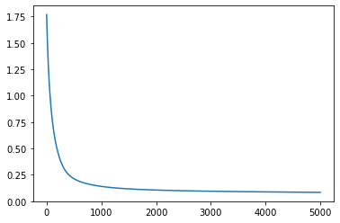
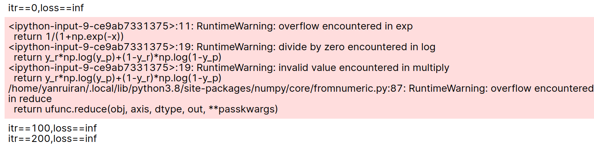

# LAB1 逻辑回归

## 1. 实验要求

### 1.1 实验简介

本次实验的总体流程是完成逻辑回归的代码实现，并在给定数据集上进行训练和验证/测试。

需要实现以下步骤：

* 训练集和测试集的读取
* （如有必要）对数据进行预处理
* 初始化逻辑回归模型
* 实现优化算法
* 在训练数据集上进行模型的参数优化，要求该步骤在有限时间内停止
* 在测试数据集上进行测试，并输出测试集中样本的预测结果（即具备准确性）
* 最后，完成实验报告

### 1.2 数据集介绍

本实验使用Breast cancer wisconsin (diagnostic) dataset （威斯康星州乳腺癌（诊断）数据集），共569条数据，30个属性（无缺失），二分类标签

发放的数据集共三个文件：

* wdbc.data：所有数据
* wdbc_train.data：助教从wdbc.data中随机切分出来的训练集数据
* wdbc_test.data: 助教从wdbc.data中随即切分出来的测试集数据

数据格式如下：

* 三个文件都是普通的文本文件，.data并不代表特殊的文件格式。
* 每个文件中，每一行表示一条数据样例，以逗号分隔，其中第1列为数据id，第2列为数据标签（有M，B两种值），其余30列依次为30个属性。
* 其中，wdbc_test.data的第二列（标签列）都是？，即代码中不应使用该文件中的标签。
* 为测试统一，需要假设输入文件都是该格式，不要改动数据格式。

### 1.3 代码要求

* 要代码实现在单一的python文件中，并命名为logistic_regression_学号.py，其中学号用自己的实际学号代替。
* 测试时会用以下命令运行代码`python logistic_regression_学号.py [train_set] [test_set]`，其中[train_set]和[test_set]分别是训练集和测试集的路径。
* 代码必须且只能在标准输出中输出test_set中样例对应的分类预测，每行一个。

* 测试时会重新切分的train_set和test_set，而非发放的train_set和test_set，以保证算法的泛化性和测试的公平性，因此，代码中也不可将训练集和测试集的样例数量等信息进行硬编码。
* 准确性验证：最终会用脚本计算代码针对test_set的预测结果的准确率(acc)作为评价指标。
* 收敛性验证：助教运行代码时会有代码运行时间上限（300s）。
* 最终评判标准：
  * 代码在规定时间内运行结束并给出规定的标准输出。
  * 代码所给出的预测结果准确率大于等于0.9。

#### 注意事项：

* 严禁在代码中直接使用scikit-learn等算法库直接实现算法，优化算法的核心代码必须手动实现
* 允许使用numpy、pandas等库进行必要的数据表示和预处理
* 测试的过程中请注意数据泄露问题

### 1.4 实验报告要求

除源代码外，需上交一份pdf格式的实验报告，命名为MLlab1_report_学号.pdf，其中学号以自己的实际学号代替。

实验报告至少须包含以下内容：

* 实验要求
* 实验原理
* 核心代码的贴图和讲解（如代码中有清楚的注释可不另外讲解）
* （可选）实验中遇到的问题及解决方案
* 实验结果的展示（最终准确率，数据可视化，训练过程中loss的可视化等）（注：这些内容只展示在实验报告中，不应在最终提交的代码里有额外输出）

### 1.5 提交要求

最终结果命名为MLlab1_学号.zip的压缩包发送至邮箱  bhy0521@mail.ustc.edu.cn，压缩包中包含以下两个文件：

* logistic_regression_学号.py
* MLlab1_report_学号.pdf

## 2. 实验原理

### 2.1 线性模型

$$
f(x) = \omega ^T x + b \  \  \   s.t.\ f(x) \approx y
$$

其中 $\omega$ ：权重；$b$ ：偏置； $x$ ：属性；$y$ ：标签。

### 2.2 广义线性模型

$$
f(x) = g^{-1}(\omega ^T x + b) \  \  \   s.t.\ f(x) \approx y
$$

其中$g(\cdot)$ 是链接函数 (link function)，单调可微，可以用以上方法进行非线性回归问题。

### 2.3 线性模型用于回归问题

为了使 $f(x) \approx y$ ，可以最小化均方误差，取 
$$
\omega =arg\ \mathop{min}\limits_{\omega}||y-X\omega||^2_2
$$
此时，可以用最小二乘法求闭式解 
$$
f(x_i) = x_i(X^TX)^{-1}X^Ty
$$
上式需要 $X^TX$ 可逆，若不可逆，则根据归纳偏好选择解或引入正则项。

### 2.4 逻辑回归

基本形式为：
$$
f(x) = \frac{1}{1+e^{-(\omega^Tx+b)}} \ \ s.t \ f(x)\approx y
$$
其中 $ y \in \{0,1\} $ ，故可用该方法实现一个二分类模型。

可以看出逻辑回归是广义线性模型的一个特例，其中
$$
g(y) = ln\frac{y}{1-y}
$$
可以用极大似然法优化参数，最大化对数似然
$$
l(\omega, b) = \sum_{i=1}^{m}y_ilogP(y=1|x_i;\omega,b)+(1-y_i)logP(y=0|x_i;\omega,b)=\sum_{i=1}^{m}logP(y=y_i|x_i;\omega,b)
$$
其中，用 $y = \frac{1}{1+e^{-(\omega^Tx+b)}}$ 来估计 $P(y=1|x_i;\omega,b)$ ，则有：
$$
P(y=1|x_i;\omega,b) = \frac{1}{1+e^{-(\omega^Tx+b)}}
\newline
P(y=0|x_i;\omega,b) = \frac{e^{-(\omega^Tx+b)}}{1+e^{-(\omega^Tx+b)}}
$$
并通过再$x$ 后加入一个数值为1的特征，可将 $b$ 加入到 $ \omega $ 之中将$l(\omega ,b)$ 转化为$l(\omega )$，再将上面两式带入 $l(\omega)$ ，最大化对数似然可以转化为最小化负对数似然：
$$
l(\omega) = -\sum_{i=1}^{m}log\frac{e^{y_iw^Tx_i}}{1+e^{w^Tx_i}} = \sum_{i=1}^{m}-y_i\omega^Tx_i +log(1+e^{w^Tx_i})
$$
考察 $f(x) = - \alpha x +ln(1+e^x)$ ，可知 $f''(x)>0$，故$f(x)$ 是凸函数。

又 $l(\omega)$ 是 $f(x)$ 与 $g(\omega) = \omega^Tx_i$ 的复合，故 $l(\omega)$ 是关于 $\omega$ 的凸函数。所以可以使用梯度下降法或牛顿法求解。
$$
\nabla l(\omega)=\sum_i f'(z_i)\frac{\part z_i}{\part \omega} = \sum_i (-y_i + \frac{1}{1+e^{-z_i}})x_i = -\sum_i(y_i-P(y=1|x_i;\omega))x_i 
\newline
\nabla^2l(\omega) = \frac{\part \nabla l(w)}{\part w^T} = \sum_ip_1(1-p_1)x_ix_i^T \ \ \ (p_1 = P(y=1|x_i;\omega))
$$
梯度下降法：

```python
while ‖∇l(w)‖>δ do
    w = w − α∇l(w)
end while
```

牛顿法：

```python
while ‖∇l(w)‖>δ do
    w = w −(∇^2 l(w))^−1 ∇l(w)
end while
```

由凸函数的性质可知，最终能求得最优解。

本次实验使用梯度下降法求最优解。

## 3. 核心代码讲解

### 3.1 数据读取

```python
# get data features
def load_data_features(datapath):
    features = []
    with open(datapath,'r') as f:
        for line in f.readlines():
            arr = []
            arr_str = line.strip().split(',')
            for i in range(2,len(arr_str)):
                arr.append(float(arr_str[i]))
            features.append(arr)
    return features

# get data labels
def load_data_labels(datapath):
    labels = []
    with open(datapath,'r') as f:
        for line in f.readlines():
            arr_str = line.strip().split(',')
            if arr_str[1] == 'M':
                label = 0
            else:
                label = 1
            labels.append(label)
    return labels
```

使用python文件读取函数，并用readlines方法读取data文件中的每一行，用strip()除去空白符号之后根据数据集的格式通过split()用逗号进行分割，存到arr_str中，load_data_features中读取arr_str中后30个字符转为float即为数据的features。load_data_labels同理，读取第二个字符即为数据标签，将M转换为0，B转换为1。

### 3.2 定义需要使用的函数

```python
def sigmoid(x):
    return 1/(1+np.exp(-x))

# sigmoid一阶导数
def dsigmoid(x):
    return sigmoid(x)*(1-sigmoid(x))

def loss(y_r,y_p): 
    return y_r*np.log(y_p)+(1-y_r)*np.log(1-y_p)

def loss_f(y_r, y_p):
    return -np.sum(np.nan_to_num(loss(y_r,y_p)))/y_r.shape[0]

def sign(y):
    for i in range(y.shape[0]):
        if y[i]<0.5:
            y[i] = 0
        else:
            y[i] = 1
    return y

def int2str(y_int):
    y_str = []
    for y in y_int:
        if y==0:
            y_str.append('M')
        else:
            y_str.append('B')
    return y_str
```

首先是sigmoid函数以及负对数似然函数loss_f，np.nan_to_num()函数是为了防止出现log0的情况，最后的loss_f还除以了一个训练数据总数即y_r.shape[0]。之后sign函数是一个阶跃函数，将小于0.5的数映射到0，大于0.5的数映射到1，以及int2str函数是将0映射到字符型标签’M’，1映射到’B’，都是为了最终好输出结果。

### 3.3 训练过程

```python
def train(X, y,itr,lr): # X:(n,31),y:(n,)
    # normalization
    X=np.array(X)
    n,m = X.shape
    y = np.array(y)
    mu = np.mean(X,axis=0)
    sigma = np.std(X,axis=0)
    X=(X-mu)/sigma
    # add ones
    X = np.c_[X,np.ones((n,1))]
    # int w
    w = np.random.randn(m+1)
    # gradient descent
    for i in range(itr):
        y_p = sigmoid(np.dot(w,X.transpose()))
        dw = np.dot((y_p-y),X)/n
        w -= lr*dw
    y_p = sigmoid(np.dot(w,X.transpose()))
    return w, mu,sigma
```

train函数传入4个参数，X：特征矩阵(shape = (n,31))，y：X对应的标签(shape = (n,))，itr：迭代次数，lr：学习率。注意传入的X是没有进行加一列1向量的处理的，所以要在函数中进行处理。

首先对X数据进行一些预处理，**预处理的方式是进行标准化**，标准化的方法是对X的每一个属性减去它的均值除以它的方差，其中均值与方差是要保留下来传递给后面的测试函数的，即用训练集的分布估计整体的数据分布，并在测试集数据中进行同样的标准化处理。

之后如上所说加入一列1向量并初始化w，用梯度下降得到最终参数w。

注意其中dw = np.dot((y_p-y),X)/n 是除以了一个n的，这是因为我们设的loss_f除以了一个n，并不影响梯度下降的结果但能有效的避免数值计算上出现的一些问题，使用标准化的预处理也是为了这个目的，详情可见下面“实验中碰到的问题”。

### 3.4 得到测试集结果并输出

```python
def get_result(X, w, mu, sigma):
    X=np.array(X)
    n,m = X.shape
    X=(X-mu)/sigma
    X = np.c_[X,np.ones((n,1))]
    y_p = sigmoid(np.dot(w,X.transpose()))
    y_p = sign(y_p)
    return int2str(y_p)
```

函数非常简单，先对测试集数据进行与训练集相同的预处理，进行标准化并加一列1向量，再通过train得到的参数得到对数机率，并用sign及int2str函数得到最终要输出的估计结果。

### 3.5 主函数

```python
if __name__ =='__main__':
    train_path = sys.argv[1]
    test_path = sys.argv[2]
    X_train = load_data_features(train_path)
    y_train = load_data_labels(train_path)
    X_test = load_data_features(test_path)
    w, mu, sigma = train(X_train, y_train, 5000, 0.01)
    results = get_result(X_test, w, mu, sigma)
    for result in results:
        print(result)
```

 有了上面的函数主函数就很简单了，先根据要求使用sys模块读取命令行参数，通过load_data_features()、load_data_labels()两个函数读取文件中的数据，之后进行训练得到w，最后通过get_result得到最终结果并打印。

## 4. 实验结果展示

实验结果是在样例训练集和测试集上测试的，ground truth是通过index索引找到总数据中的labels，再测试准确率。

实验的参数设置如下：

```json
itr:5000
lr:0.01
```

**测试结果：**

准确率（因为w初始化的不同，故会得到不同结果，实验中测试了五次）：


loss曲线：



## 5. 实验碰到的问题——数值精度问题

在一开始的程序中并没有对数据进行任何的预处理，然后就会出现数值溢出的问题，主要的溢出的地方是在loss的计算和sigmoid函数计算中出现数值溢出。

### 5.1 loss 函数的溢出

**出现的问题：**



loss直接变成了inf，其主要原因是因为loss_f的计算中有log函数，而因为数据分布数值上比较分散，很容易出现极端的$p$值，比如$p\approx 1$或$p\approx 0$，这时$logp$数值精度不够就会导致loss算出来是inf.

**解决方式：**

可以在每个log中加入一个很小的项epsilon，将loss函数改为如下：

```python
def loss(y_r,y_p):
    eps = 1e-5
    return y_r*np.log(y_p+eps)+(1-y_r)*np.log(1-y_p+eps)
```

这样就不会有log溢出的问题了。

### 5.2 sigmoid函数溢出问题

**出现的问题：**


这是因为exp函数中若x是很小的负数会得到很大的结果出现溢出，这样就会出现loss函数剧烈抖动的问题，如图所示：


**解决方式：**

分正负求sigmoid，正数就用 $\frac{1}{1+e^{-x}}$ 求解，负数就用 $\frac{e^x}{1+e^x}$ 求解，就能避免exp的overflow问题，可以将sigmoid函数修改如下：

```python
def sigmoid(x):
    mask = (x>0)
    po = np.zeros_like(x,dtype='float64')
    no = np.zeros_like(x,dtype='float64')
    po = 1/(1+np.exp(-x, po, where=mask))
    po[~mask]=0
    expx = np.exp(x,no,where=~mask)
    no = expx/(1+expx)
    no[mask] = 0
    return po+no
```

### 5.3 解决一切数值问题的方法

以上问题都是使用数值求解上的一些方式来解决，对于一名专业的~~调参大师~~数据科学家，自然不屑于用这种方式解决问题，要从源头解决这个问题。

这个问题的原因就是数据集有些维度的数据分布很极端，解决这一问题的一个很好的方式就是**标准化**，将每一维度normalize一下，这样就不会出现溢出问题了，也能得到很好的结果，**实验提交的代码以及结果呈现中都是使用的标准化方法**。

## 6. 实验总结

本次实验实现了广义线性回归模型中的逻辑回归，中间碰到了许多问题，通过想各种方法找出了解决方式，收获颇丰，特别是对数值计算过程中碰到的问题。因为没有动手实现逻辑回归之前，虽然在理论上搞明白了这一问题，但忽略了实际代码中需要注意的东西，比如如何解决数值溢出问题，所以这次实验可以说是加深了对机器学习算法的理解，更说明了对算法的理解不能只停留在纸面，只有当你取实现算法时才能真正知道问题在哪。

