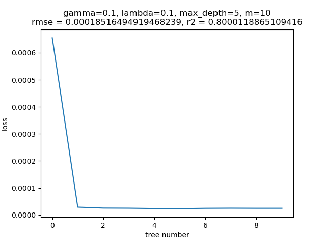
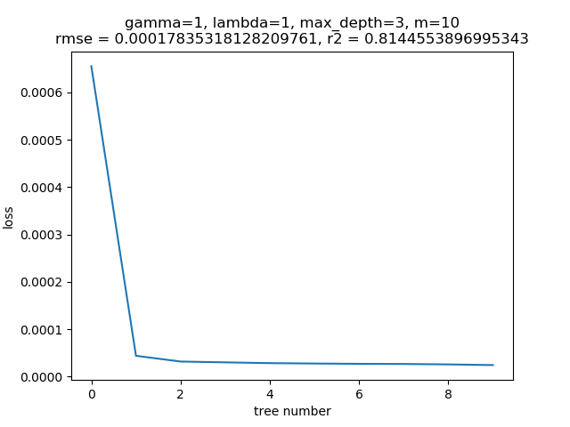
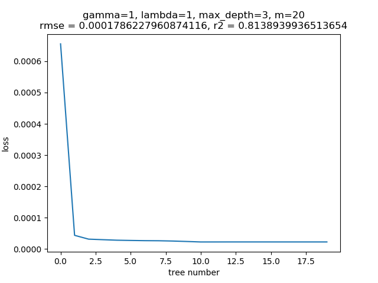

# MLlab2 report

## 实验要求

### 实验简介

通过第八章集成学习的课程学习，实现一个自己的xgboost。具体的任务是以一个决策树为基模型的xgboost实现一个回归任务。

### 数据集介绍

回归模型的训练数据集如文件夹里面给定，包含7154行，41列，前40列是feature，最后一列是要预测的标签。可以自行在训练数据里面划分出部分数据当作验证集合。

### 提交要求

除源代码外，每位同学需上交一份pdf格式的实验报告，命名为MLlab2_report_*学号*.pdf，其中*学号*以自己的实际学号代替。

实验报告至少须包含以下内容：

* 实验要求
* 实验原理
* 怎么设置程序停止运行的标准，决策树的节点停止划分的标准
* 核心代码的贴图和讲解（如代码中有清楚的注释可不另外讲解）
* （可选）实验中遇到的问题及解决方案
* 实验结果的展示（最终RMSE，R^2，数据可视化，训练过程中loss的可视化等）

## 实验原理

XGBoost 是由多个基模型组成的一个加法模型，假设第k个基本模型是f_k(x), 那么前t个模型组成的模型的输出为
$$
\widehat{y}_{i}^{(t)}=\sum_{k=1}^{t} f_{k}\left(x_{i}\right)=\widehat{y}_{i}^{(t-1)}+f_{t}\left(x_{i}\right)
$$
其中$x_i$为第表示第i个训练样本，$y_i$表示第i个样本的真实标签； $y ̂_i^{(t)}$表示前t个模型对第i个样本的标签最终预测值。

在学习第t个基模型时，XGBoost要优化的目标函数:
$$
\begin{aligned}
\operatorname{Obj}^{(t)} &=\sum_{i=1}^{n} \operatorname{loss}\left(y_{i}, \widehat{y}_{i}^{(t)}\right)+\sum_{k=1}^{t} \text { penalt } y\left(f_{k}\right) \\
&=\sum_{i=1}^{n} \operatorname{loss}\left(y_{i}, \widehat{y}_{i}^{(t-1)}+f_{t}\left(x_{i}\right)\right)+\sum_{k=1}^{t} \text { penalt } y\left(f_{k}\right) \\
&=\sum_{i=1}^{n} \operatorname{loss}\left(y_{i}, \widehat{y}_{i}^{(t-1)}+f_{t}\left(x_{i}\right)\right)+\text { penalt } y\left(f_{t}\right)+\text { constant }
\end{aligned}
$$
其中n表示训练样本的数量, $penalty(f_k)$表示对第k个模型的复杂度的惩罚项，由于依次学习每个基模型，所以当学习第t个基模型时，前t−1个基模型是固定的，其penalty是常数。。$\operatorname{loss}\left(y_{i}, \widehat{y}_{i}^{(t)}\right)$表示损失函数。

例如二分类问题中，损失函数为
$$
\operatorname{loss}\left(y_{i}, \widehat{y}_{i}^{(t)}\right)=-y_{i} \cdot \log p\left(\widehat{y}_{i}^{(t)}=1 \mid x_{i}\right)-\left(1-y_{i}\right) \cdot \log \left(1-p\left(\widehat{y}_{i}^{(t)}=1 \mid x_{i}\right)\right)
$$
回归问题中损失函数为
$$
\operatorname{loss}\left(y_{i}, \widehat{y}_{i}^{(t)}\right)=\left(y_{i}-\widehat{y}_{i}^{(t)}\right)^{2}
$$
学习第t个基模型时，要优化的目标是：
$$
\operatorname{Obj}^{(t)} =\sum_{i=1}^{n} \operatorname{loss}\left(y_{i}, \widehat{y}_{i}^{(t-1)}+f_{t}\left(x_{i}\right)\right)+\text { penalt } y\left(f_{t}\right)+\text { constant }
$$
将$\operatorname{loss}\left(y_{i}, \widehat{y}_{i}^{(t-1)}+f_{t}\left(x_{i}\right)\right)$在$\widehat{y}_{i}^{(t-1)}$处泰勒展开可得：
$$
\operatorname{loss}\left(y_{i}, \widehat{y}_{i}^{(t-1)}+f_{t}\left(x_{i}\right)\right) \approx \operatorname{loss}\left(y_{i}, \widehat{y}_{i}^{(t-1)}\right)+g_{i} f_{t}\left(x_{i}\right)+\frac{1}{2} h_{i} f_{t}^{2}\left(x_{i}\right)
$$
其中
$$
g_{i}=\frac{\partial \operatorname{loss}\left(y_{i}, \widehat{y}_{i}^{(t-1)}\right)}{\partial \widehat{y}_{i}^{(t-1)}}, h_{i}=\frac{\partial^{2} \operatorname{loss}\left(y_{i}, \widehat{y}_{i}^{(t-1)}\right)}{\partial\left(\bar{y}_{i}^{(t-1)}\right)^{2}}
$$
此时$\operatorname{Obj}^{(t)}$去掉常数项$\operatorname{loss}\left(y_{i}, \widehat{y}_{i}^{(t-1)}\right)$和$\operatorname{constant}$可得目标函数为
$$
O b j^{(t)}=\sum_{i=1}^{n}\left[g_{i} f_{t}\left(x_{i}\right)+\frac{1}{2} h_{i} f_{t}^{2}\left(x_{i}\right)\right]+\text { penalt } y\left(f_{t}\right)
$$
实验要解决回归问题，于是
$$
\operatorname{loss}\left(y_{i}, \widehat{y}_{i}^{(t-1)}\right) = \left(y_{i}- \widehat{y}_{i}^{(t-1)}\right)^2
$$
故
$$
g_{i}=\frac{\partial \operatorname{loss}\left(y_{i}, \widehat{y}_{i}^{(t-1)}\right)}{\partial \widehat{y}_{i}^{(t-1)}}=-2\left(y_{i}- \widehat{y}_{i}^{(t-1)}\right),
h_{i}=\frac{\partial^{2} \operatorname{loss}\left(y_{i}, \widehat{y}_{i}^{(t-1)}\right)}{\partial\left(\widehat{y}_{i}^{(t-1)}\right)^{2}}=2
$$
本次实验使用决策树作为基模型。假设决策树有T个叶子节点，每个叶子节点对应有一个权重。决策树模型就是将输入$x_i$映射到某个叶子节点，决策树模型的输出就是这个叶子节点的权重。

即$f(x_i)=w_{q(x_i)}$，w是一个要学的T维的向量其中$q(x_i)$表示把输入$x_i$映射到的叶子节点的索引。例如：$q(x_i)=3$，那么模型输出第三个叶子节点的权重，即$f(x_i)=w_3$。

决策树模型中惩罚项为：
$$
\text { penalt } y(f)=\gamma \cdot T+\frac{1}{2} \lambda \cdot\|w\|^{2}
$$
其中$T$为叶子节点的数目，$\gamma,\lambda$为可调的超参。

当树结构确定时，用$I_j$表示分配到第$j$个叶子节点上的样本，由前面可知：
$$
\begin{aligned}
O b j^{(t)}=& \sum_{i=1}^{n}\left[g_{i} f_{t}\left(x_{i}\right)+\frac{1}{2} h_{i} f_{t}^{2}\left(x_{i}\right)\right]+\text { penalt } y\left(f_{t}\right) \\
=& \sum_{i=1}^{n}\left[g_{i} w_{q\left(x_{i}\right)}+\frac{1}{2} h_{i} w_{q\left(x_{i}\right)}^{2}\right]+\gamma \cdot T+\frac{1}{2} \lambda \cdot\|w\|^{2} \\
=& \sum_{j=1}^{T}\left[\left(\sum_{x \in I_{j}} g_{i}\right) \cdot w_{j}+\frac{1}{2} \cdot\left(\sum_{i \in I_{j}} h_{i}+\lambda\right) \cdot w_{j}^{2}\right]+\gamma \cdot T
\end{aligned}
$$
记：
$$
G_{j}=\sum_{i \in I_{j}} g_{i}, \quad H_{j}=\sum_{i \in I_{j}} h_{i}
$$
则目标函数变为：
$$
O b j^{(t)}=\sum_{j=1}^{T}\left[G_{j} w_{j}+\frac{1}{2}\left(H_{j}+\lambda\right) w_{j}^{2}\right]+\gamma T
$$
该式为二次函数，能求解出解析解$w^*_j = -\frac{G_j}{H_j+\lambda}$，得出$O b j^{(t)}$的极值：
$$
O b j^{(t)} = -\frac{1}{2} \sum_{j=1}^{T}\frac{G^2_j}{H_j+\lambda} +\gamma T
$$
考虑每次将节点划分为左孩子和右孩子，划分前：
$$
Obj_1 = -\frac{1}{2} \frac{G^2}{H+\lambda}+\gamma
$$
划分后：
$$
Obj_2 = -\frac{1}{2} (\frac{G^2_L}{H_L+\lambda}+\frac{G^2_R}{H_R+\lambda})+2 \gamma
$$
要让划分后$Obj$减少最多，可令$gain = Obj_1-Obj_2$，令$gain$最大即可。

注意到这里有恒等关系$G=G_L+G_R, H=H_L+H_R$，这在后面简化算法有重要意义。

找最大收益划分的算法使用贪心算法，，即对每个特征按该特征排序后用每个值划分直到找到最大的gain，返回最大gain对应的特征和划分值。

通过贪心算法得到第M颗树后，更新最终预测结果为:$y ̂_i=\sum_{t=1}^{M}f_t(x_i)$，知道更新到设定树上限为止。

最终得到的$\widehat{y}_i$即为所求。

实验的评价指标可以考虑如下指标：

* RMSE指标，其值越小越好
* R^2指标，其值越大越好

## 决策树停止划分的标准

本次实验采取的决策是停止划分的标准是简单的限制最大深度，即在实例化模型的过程中要给出参数max_depth，这个参数将限制每颗树的最大深度，当决策树划分到该深度时结束划分。

## 代码讲解

本次实验代吗共四份python文件，分别为data_process.py、evaluate.py、main.py、Xgboost.py。其主要内容为：

* Xgboost.py：实现Xgboost类
* data_process.py：数据读取与处理的的一个python模块
* evaluate.py：模型评估函数的模块
* main.py：主函数文件，对代码进行测试

数据处理、评估和主函数这里就不作过多讲解，主要介绍Xgboost的实现。

### Xgboost.py：

主要实现3个类：

* class Node
* class DecisionTree
* class XGboost

#### class Node

Node类对应xgboost中基模型决策树的节点，定义如下：

```python
class Node(object):
    def __init__(self):
        self.l = None
        self.r = None
        self.feature = None
        self.f_value = None
        self.isleaf = False
        self.depth = None
        self.omega = None
```

self.l与self.r指向该节点的左孩子和右孩子。self.isleaf标记该节点是否为叶子节点，若是叶子节点则代表决策树在该点停止划分了，便要在该节点中存储self.oemega即节点权重信息；否则，记录划分的特征(self.feature)与划分的值(self.f_value)。同时self.depth记录该节点在树中的深度。

#### class DecisionTree

DecisionTree是Xgboost中的基模型，基于上面的Node实现，定义如下：

```python
class DecisionTree(object):
    def __init__(self, data, gamma, lambda_p, max_depth=20):
        # data最后一列为y_t，shape = (n,42)
        self.gamma = gamma
        self.lambda_p = lambda_p
        self.max_depth = max_depth
        self.feature = None
        self.f_value = None
        self.root = self.createTree(data, 0)
```

gamma、lambda_p与max_depth是超参，max_depth定义树的最大深度。feature与f_value记录每次通过贪心算法得到的应该划分的特征与划分的值，用于参数传递。self.root即为该树对应的根节点，是一个Node类变量。

传入参数要传入一个data代表数据。数据的格式为$[X,y,y_{t-1}]$组成的数组，shape为(n,m+2)，n代表样本数，前m列为特征，m+1列为标签m+2列为前面所有的树预测的结果。

DecisionTree中的方法如下：

前三个是一些计算公式函数，函数的意义如其名字。

```python 
    def get_obj1(self, G, H):
        return 0.5 * G ** 2 / (H + self.lambda_p) + self.gamma

    def get_obj2(self, Gl, Hl, Gr, Hr):
        return 0.5 * (Gl ** 2 / (Hl + self.lambda_p) + Gr ** 2 / (Hr + self.lambda_p)) + 2 * self.gamma

    def get_omega(self, data):
        n, F = data.shape
        y_t, y = data[:, -1], data[:, -2]
        G = np.sum(-2 * (y - y_t))
        H = 2 * n
        return -G / (H + self.lambda_p)
```

接下来是建树。

```python
    def createTree(self, data, depth):
        if depth < self.max_depth:
            root = Node()
            root.depth = depth
            # find split
            n, F = data.shape
            F -= 2
            y_t, y = data[:, -1:], data[:, -2:-1]
            G = np.sum(-2 * (y - y_t))
            H = 2 * n
            obj1 = self.get_obj1(G, H)
            max_gain = 0
            for feature in range(F):
                tmp = np.c_[data[:, feature:feature + 1], -2 * (y - y_t)]
                sorted_f_value_list = tmp[np.argsort(tmp[:, 0])]
                Gl, Gr, Hl, Hr = 0, G, 0, H
                for i in range(sorted_f_value_list.shape[0]):
                    # 小于等于i时划分到左侧
                    Gl += sorted_f_value_list[i, -1]
                    Gr = G - Gl
                    Hl += 2
                    Hr = H - Hl
                    obj2 = self.get_obj2(Gl, Hl, Gr, Hr)
                    gain = obj2 - obj1
                    if gain > max_gain:
                        max_gain = gain
                        self.feature, self.f_value = feature, sorted_f_value_list[i, 0]
            root.feature, root.f_value = self.feature, self.f_value
            data_l = data[data[:, self.feature] <= self.f_value, :]
            data_r = data[data[:, self.feature] > self.f_value, :]
            root.l = self.createTree(data_l, depth + 1)
            root.r = self.createTree(data_r, depth + 1)
            return root
        else:
            leaf = Node()
            leaf.depth = depth
            leaf.isleaf = True
            leaf.omega = self.get_omega(data)
            return leaf
```

createTree函数创建一棵决策树，首先判断深度是否到达max_depth用于递归的边界判定。之后生成节点并进行深度的赋值并计算G、H。

之后进行贪心算法，对每个特征，对该特征进行排序（从小到大），**为了减少时间开销，用一个tmp存储每次查找feature时的样本特征值及其预测值与真实标签的残差，对tmp的value进行排序可以很好的减少时间开销**。之后记录最大的gain，通过self.feature与self.f_value传值在后面进行节点的划分，值小于等于f_value划分到左子树，其余的划分到右子树，然后递归生成其左子树和右子树。

这里计算obj2进行了一个小trick，没有重新计算GL、GR、HL、HR，因为这样会非常耗时，这在后面“实验中遇到的问题与解决方案”中有所解释。由于已经进行了排序，每次划分搜索都是多加一个右子树中的最小的值，所以可以直接在GL中加上搜索到的值、GR中减去该值，H进行相同的操作。这样就能将原本O(n)的复杂度降到O(1)，大大的减少了时间开销。

最后进行边界处理，当发现节点达到max_depth即将该节点设为叶子节点，令其isleaf属性为True并赋值节点权重。

最后是决策树的inference。

```python
  def inference(self, x):
        p = self.root
        while not p.isleaf:
            if x[p.feature] <= p.f_value:
                p = p.l
            elif x[p.feature] > p.f_value:
                p = p.r
        return p.omega
```

传入一个样本，求其对应权重，只需看该样本的节点中的feature特征，进行搜索，得到最终权重。

最后是实现xgboost，xgboost的构造函数如下：

```python
class XGboost(object):
    def __init__(self,
                 gamma=0,
                 lambda_p=0,
                 max_depth=4,  # 最大深度
                 m=10  # 子树个数
                 ):
        self.gamma = gamma
        self.lambda_p = lambda_p
        self.max_depth = max_depth
        self.m = m
        self.TreeList = []
```

需要传入4个超参，超参解释如注释所示。TreeList记录所有得到的决策树，在pridict的时候遍历TreeList进行inference即可。

xgboost中的方法就是简单的fit和pridict：

```python
 def fit(self, X, y):
        if len(self.TreeList) is not 0:
            self.TreeList = []
        y_t = np.zeros(y.shape)
        data = np.c_[X, y, y_t]
        for i in range(self.m):
            print(f"No.{i + 1} tree is building ......")
            tree = DecisionTree(data, self.gamma, self.lambda_p, self.max_depth)
            self.TreeList.append(tree)
            print(f"No.{i + 1} tree has built,wait for the next tree ......")
            data[:, -1:] = self.predict(X)

    def predict(self, X):
        # X:(N,40)
        if len(self.TreeList) == 0:
            print("TreeList is empty, you need to fit data first")
        else:
            n, _ = X.shape
            y_pre = np.zeros((n, 1))
            for i in range(n):
                for tree in self.TreeList:
                    y_pre[i, 0] += tree.inference(X[i])
            return y_pre
```

fit时传入X、y，按决策树接口中所给定的data格式进行处理，刚开始时data的最后一列设为全0，因为还没有生成任何一棵决策树，所以预测值都是0。之后根据所给的字数个数进行循环，每次生成一棵树并加入TreeList，生成完后通过self.predict得到预测值并将其赋值到最后一列作为新的y_t，循环m次。

predict就是简单的遍历TreeList中所有的树，对每个树进行Inference并对结果相加，得到预测值。

最后为了最后的结果展示，加入了get_loss()和draw_pic()方法：

```python
    def get_loss(self, X, y):
        if len(self.TreeList) == 0:
            print("TreeList is empty, you need to fit data first")
        else:
            n, _ = X.shape
            y_pre = np.zeros((n, 1))
            losslist = []
            for i in range(len(self.TreeList)):
                for tree in self.TreeList[:i]:
                    for j in range(n):
                        y_pre[j, 0] += tree.inference(X[j])
                loss = np.sum((y - y_pre) ** 2)
                y_pre = np.zeros((n, 1))
                losslist.append(loss)
            return np.array(losslist)

    def draw_pic(self, X, y):
        losslist = self.get_loss(X, y)
        y_pre = self.predict(X)
        rmse = get_RMSE(y, y_pre)
        r2 = get_Rsquare(y, y_pre)
        plt.plot(losslist)
        plt.xlabel("tree number")
        plt.ylabel("loss")
        plt.title(
            f"gamma={self.gamma}, lambda={self.lambda_p}, max_depth={self.max_depth}, m={self.m}\nrmse = {rmse}, r2 = {r2}")
        plt.show()
```

画出loss-tree_num图像。具体实现方式为：对每一棵树进行遍历，得到前t棵树的预测结果形成一个Losslist，再将losslist画出，并在标题中加入所使用的参数及模型评估结果。

## 实验中遇到的问题及解决方案

**遇到的问题1：**

时间开销过大，生成决策树时间过长。

**解决方案：**

主要进行优化的地方在建树的过程中，首先，排序过程可以不用将所有的数据进行排序，只需要对遍历到的特征及其对应的标签这两列进行排序，用一个tmp存储每次查找feature时的样本特征值及其预测值与真实标签的残差，对tmp的value进行排序可以很好的减少时间开销。

还有个关键的优化，由于已经进行了排序，每次左子树与之前想必只是加上了一个新的节点，右子树相应减去了该节点，所以不需要重新计算OBJ只需要在之前OBJ的基础上直接在GL中加上搜索到的值、GR中减去该值，H进行相同的操作，这样这步原本O(n)的复杂度就会变成O(1)，大大降低了时间。

**遇到的问题2：**

决策树鲁棒性问题。当出现划分情况非常极端的情况，如一边只有一个节点，会出现鲁棒性问题，树无法再继续划分。

**解决方案：**

对节点的数据量进行判断，当数据量小于某个阈值的时候直接停止划分。这种操作同时也避免了过拟合问题。

**遇到的问题3：**

过拟合问题。由于数据量较少，xgboost模型又很强大，实验时经常出现过拟合现象，即用越深、越多的树训练出来的模型反而效果更差。

**解决方案：**

调参。将$\gamma, \lambda$尽量往大调，将树的深度和多少设小一点（其中深度尤为重要）。在“实验结果展示”中我提供了一些参数，可供选用。

## 实验结果展示

### 数据展示：

本次实验将数据集split，验证集的比例为10%，为保证每次划分相同，使用seed定其值为101。

数据规格展示如下：


### 结果展示

通过一下几组参数，进行了实验，结果如下：









可以看出，基本上第一棵树就让loss降了非常多，特别是层数深的树，后面基本拟合的是很小的loss，这也就导致后面的树被噪声影响较大，出现过拟合现象——即**越多的树反而效果并不佳**。

由于篇幅限制，还有一些其他的实验结果再次就不一一展示，通过大量的实验，可以看出，xgboost模型非常容易过拟合，所以要将gamma和lambda设大一点(到1这个数量级)，max_depth设小(不要超过5棵)，m也不要过大(一般在10~20之间)。

之后助教给了一份测试文件，在data文件夹，通过(gamma, lambda_p, max_depth, m = 1, 1, 3, 10)这组参数，在测试集上进行测试，测试结果如下：


### 与线性回归进行对比

在最后，我用sklearn库中的linear regression对数据进行了回归并与xgboost的结果进行了比较，比较结果如下：


可以看到，xgboost与线性回归结果十分接近。为什么复杂的xgboost效果还不如线性回归呢？这是因为这个数据集十分的简单，xgboost非常容易过拟合，所以其效果不佳。当然，只要你参数调的好，xgboost也绝对能效果比linear regression效果好的。

这里也再次告诉我们，模型并不是越复杂越好，简单模型也有简单模型的好处，有时候，复杂的模型不仅达不到预期的效果，还耗时耗算力，因为一个复杂的模型很容易陷入过拟合的风险。所以要根据数据集来灵活地选择适用的模型，而不是永远选最复杂的模型。

## 提交说明

本次实验完全按提交规则提交，特在此进行说明。

压缩包中是实验报告与名为decision_tree_xgboost的文件夹。文件夹中包括两个文件夹src与data分别存放源码与数据，src文件夹内容见“代码讲解”，data中train.data文件为训练集，ailerons.test为测试集，运行main.py即可得到上述测试结果。

