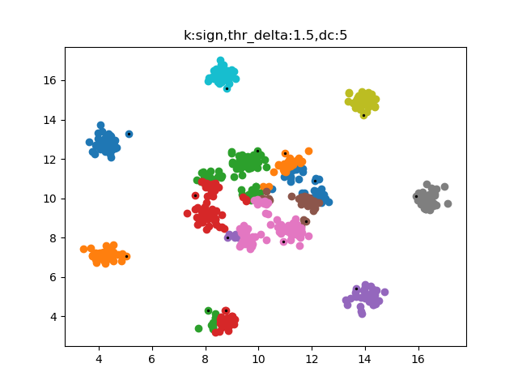

# MLlab3 report

**PB190001956 晏瑞然**

## 实验要求

### 实验简介

本次实验复现Clustering by fast search and find of density peaks论文，下面简称DPC算法。

### 数据集介绍

本次实验采用 3 个 2D 数据集（方便可视化）:

* Datasets/D31.txt
* Datasets/R15.txt
* Datasets/Aggregation.txt

数据格式:

* 每个文件都是普通的 txt 文件，包含一个数据集
* 每个文件中，每一行表示一条数据样例，以空格分隔

注意，允许对不同数据集设置不同的超参数。

### 提交要求

除源代码外，每位同学需上交一份pdf格式的实验报告，命名为MLlab3_report_*学号*.pdf，其中*学号*以自己的实际学号代替。

实验报告至少须包含以下内容：

* 实验要求
* 实验原理
* 核心代码的贴图和讲解（如代码中有清楚的注释可不另外讲解）
* （可选）实验中遇到的问题及解决方案
* 实验结果的展示（可视化和评价指标）

##　实验原理

### 算法思想

集成了 k-means 和 DBSCAN 两种算法的思想:

* cluster centers are surrounded by neighbors with lower local density
* They are a relatively large distance from any points with a higher local density 

### 算法流程

1. 设置超参$d_c$
2. 对每个点$i$，计算$\rho_i,\delta_i$，计算方法如下：
   * Local density: $\rho_i = \sum_j \chi(d_{ij}-d_c)$, where $\chi(x)=1 $ if $x<0$ and $χ(x)=0$ otℎerwise
   * Distance from points of higher density:$\delta_i = \min _{j:\rho_j>\rho_i}d_{ij}$，for highest density :$\delta_i = \max _j d_{ij}$
3. 判别聚类中心(cluster centers)和噪声点(out-of-distribution,ODD):
   * Cluster centers: with both high $\rho_i$ and $\delta_i$
   * OOD points: with high $\delta_i$ but low $\rho_i$
   * 画出决策图，人工判断
4. 去掉噪声点，对每一个非中心点，将其分配到它最邻近且密度比其大的数据点所在的簇。

### 算法改进：高斯核密度估计

在实验中出现聚类效果极差的情况，这是因为上述density的计算是阶跃函数，所以分布很不平滑，容易出现参数敏感问题，导致聚类效果很差。论文原文中聚类效果非常好是因为其使用了高斯核密度估计，即可以采用高斯函数来估计密度，这能使密度分布更加平滑。

具体的高斯核密度估计就用概率密度分布来表征其密度，将每个样本点看作满足相同的高斯分布，将高斯分布叠加，得到新的一个概率密度分布。由于算法中密度的绝对值并不关键，所以不用像概率密度分布一样进行归一化（当然也可以进行归一化），具体密度计算公式如下：
$$
\rho_i = \sum_j e^{\frac{d_{ij}^2}{d_c^2}}
$$
其他的算法流程不改变。

用高斯核密度估计能产生很好的效果，见“实验中遇到的问题及解决方案”。

## 代码讲解

```python
class DPC(object):
    def __init__(self,dc):
        self.dc = dc
        self.dij = None
        self.density = None
        self.delta = None
        self.thr_den = None
        self.thr_delt = None
        self.parent_index = None
        self.cluster_list = None
```

首先封装一个DPC类。只需给出$d_c$参数，属性中dij是点之间的距离矩阵，density就是每个数据点的density组成的数组，delta同理，thr_den与thr_delt是后面需要设置的人工选择中心的density和delta的阈值。parent_index是一个索引表，对每个点指向其最邻近且密度比其大的数据点，方便后面聚类回溯。cluster_list是最终输出聚类结果数组。

```python
    def distance(self, x1, x2):
        return np.sum((x1 - x2) ** 2) ** 0.5

    def get_dij(self, X):
        n, m = X.shape
        self.dij = np.zeros((n, n))
        for i in range(n):
            for j in range(n):
                self.dij[i, j] = self.distance(X[i], X[j])
        # print("dij:")
        # print(self.dij)
        return self.dij

    def get_density_i(self, X):
        if self.dij is None:
            self.get_dij(X)
        if self.k == 'sign':
            d = self.dij - self.dc
            self.density = np.zeros(d.shape[0])
            for i, di in enumerate(d):
                self.density[i] = di[di < 0].size
        elif self.k == 'gauss':
            self.density = np.sum(np.exp(-self.dij ** 2 / (self.dc ** 2)),axis=1)
            # print(self.density)
        else:
            print('you need to input a kernel')
        return self.density
```

接下来是得到每个点的density。先计算两点之间的距离矩阵，这里直接暴力遍历，之后根据density的计算公式 $\rho_i = \sum_j \chi(d_{ij}-d_c)$得到density数组。这里按照论文的说法，加入了高斯核的密度估计，计算公式为 $\rho_i = \sum_j e^{\frac{d_{ij}^2}{d_c^2}}$，具体解释见前面“实验原理”及后面“实验中遇到的问题与解决方案”。

```python
    def get_delta_i(self, X):
        if self.density is None:
            self.get_density_i(X)
        self.delta = np.zeros(self.density.shape[0])
        max_den = np.max(self.density)
        self.parent_index = np.zeros(self.density.shape[0]).astype('int')
        for i, di in enumerate(self.dij):
            if self.density[i] == max_den:
                self.delta[i] = np.max(di)
                self.parent_index[i] = i
            else:
                di[self.density <= self.density[i]] = float("inf")
                self.delta[i] = np.min(di)
                self.parent_index[i] = np.argmin(di)
        return self.delta, self.parent_index
```

之后，得到每个点的Distance from points of higher density，，注意在求最近邻的density比其大的点时不仅记录距离，还要将该点的下标记录下来，存到self.parent中，方便后面回溯。具体求法是将density不大于该点的density的点距离都设为inf得到新的di，这样只需找到新的di中找最小的数和该数的下标即可。

```python
    def dpc(self, X):
        self.dij = self.get_dij(X)
        self.density = self.get_density_i(X)
        self.delta, self.parent_index = self.get_delta_i(X)
```

封装一个得到density和delta的方法。

```python
    def draw_decision_graph(self, X):
        if self.delta is None:
            self.dpc(X)
        # print(self.density)
        # print(self.delta)
        plt.scatter(self.density, self.delta)
        plt.xlabel("density")
        plt.ylabel("delta")
        plt.show()
```

该方法画出一个决策图，先得到density和delta，然后用plt.scatter画出对应点即可。

```python
    def recall(self, i):
        p = self.parent_index[i]
        while self.cluster_list[p] == -1:
            p = self.parent_index[p]
        self.cluster_list[i] = self.cluster_list[p]

    def cluster(self, X, den, delt):
        if self.delta is None:
            self.dpc(X)
        self.thr_den = den
        self.thr_delt = delt
        n, _ = X.shape
        self.cluster_list = -1 * np.ones(n).astype('int')
        centers = np.where(np.logical_and(self.density > den, self.delta > delt))[0]
        # print('centers:')
        # print(centers)
        c_num = centers.shape[0]
        for i, center in enumerate(centers):
            self.cluster_list[center] = i
            self.parent_index[center] = center
        for i in range(n):
            self.recall(i)
        # print('cluster list:')
        # print(self.cluster_list)
        for i in range(c_num):
            x = X[self.cluster_list == i]
            plt.scatter(x[:,0],x[:,1])
            # plt.scatter(X[centers[i],0],X[centers[i],1],c=color[-2])
        plt.title(f'k:{self.k},thr_delta:{self.thr_delt}')
        plt.show()
        return self.cluster_list
```

接下来就是对其他非中心点进行聚类，需要传入参数作为self.thr_den与self.thr_delt。通过这两个参数得到选择中心，只需判断每个点的density与delta是否大于阈值即可。得到的中心记录在center数组中。对于聚类中心的点，将其parent_index设为自己，这么做是为了方便回溯时的终止，然后在cluster_list中对中心点的类进行设置，第i类就设为i，其他点cluster_list全部设为-1。

同时还要实现一个回溯算法recall。对任意一个点，recall函数不停的找其parent节点，即不停的找density大于该点且距离最小的点，直到找到一个已分类的点，将其归为该类。

最后对将每个类的点用plt.scatter画出图像，返回cluster_list，方便后面进行结果评估。

## 实验中遇到的问题及解决方案

### 问题1

第2、3个数据集用原始算法聚类效果极差。

### 问题1解决方案

采用高斯核，如“实验原理”中所介绍的那样计算高斯核密度。

用第3个训练集(R15训练集)作对比。

当使用阶跃函数(k=sign)时，调节dc以及阈值，得到的一个相对最好的结果如下，此时正确的分出了15簇，但划分效果非常差，可以看到，对于边界上的簇算法能够相对正确的聚类(有一簇过拟合了)，但对于最中间中间一簇，算法完全无法正确识别。图片中黑点代表找到的cluster centers，从下图可以看出算法并没有聚类出中间那一簇。



当使用高斯核后，同样调节dc及阈值得到以下结果：


可以看出，算法很好的找到了所有的中心点，包括最中间的簇，效果非常好，而且通过gauss密度估计，使得density的分布更加平滑，调参过程也变得更加容易，问题2中也有所解释。

### 问题2

参数设置问题。实验结果对参数设置十分敏感，包括dc和密度和delta阈值的设置。

### 问题2解决方案

对于dc论文原文有讲，数据集足够大时，算法效果对dc就不敏感了。同时，经实验采用高斯核的密度计算方法时算法对dc的敏感程度会降低，这也很好理解，因为在高斯核中dc代表的是分布的标准差，而在原算法中density的计算是阶跃的，所以很容易出现dc改变一点点而$\rho_c$就大幅改变。

但是当数据量很大时，结果就对阈值的设置十分敏感，因为很容易出现两个在决策图中十分相近的点，就很难将他们分开。如下面两图所示，两张图采用相同的$d_c=2$，但delta的阈值第一张图为1，第二张图为0.5，两者只差0.5，但一个出现了欠拟合现象（本该分开的簇没有分开），一个出现了过拟合现象（将本该在一类的簇分开了）。


对于阈值的设置，由于给出的数据集基本没有噪声点，所以不用考虑delta的阈值，只需考虑delta的阈值，如果出现不好划分的情况，即两个点的delta很近但又必须将其分为两个，人为设置阈值很难设置，可以从大到小读取delta对应的点作为centers，这也就可以根据想要聚类的簇数，与Kmeans算法一样设定k值，避免出现阈值难以划分的情况。

## 结果展示：

聚类结果的可视化图中的黑点代表聚类中心。

### Aggregation数据集

采用阶跃函数计算密度，设置参数：dc=16, density threshold=3，结果如下：

决策图：


可视化聚类结果：


聚类中心个数、DBI指标：


### D31

采用高斯核计算密度，设置参数：dc=1, density threshold=2，结果如下：

决策图


可视化聚类结果：


聚类中心个数、DBI指标：


### R15数据集

采用高斯核计算密度，设置参数：dc=0.75, density threshold=0.7，结果如下：

决策图：


可视化聚类结果：


聚类中心个数、DBI指标：


## 实验总结

本次实验复现了2014年的Clustering by fast search and find of density peaks论文，在复现过程中遇到了许多困难，DPC算法效果非常好，真正操作过程中有许多tricks，如果只用论文介绍的算法，实验效果并不会很好。而文章中提到了可以采用指数核和高斯核的方法来进行密度评估，这样计算得到的密度就变得平滑，结果也非常好，也只有这样做才能达到文章所展示的效果。所以在读论文的过程中一定要细心认真，不能自以为是。可能文章一个短句漏掉了你就没有发现文章使用了一个小trick，而导致最终结果无法复现，所以读论文特别是复现论文时一定要沉下心来，不能浮躁，能投到science的论文作者肯定也是字斟句酌，读论文时应认真体会，不能似是而非的读。

这次实验也很好的增强了我读文献的能力，高斯核的计算方式在文章中并没有给出，而是需要查看它的参考文献，通过大量的文献阅读，最终完成了本次实验。这样不仅让我学到了许多的知识，也让我复现完成后非常有成就感。
