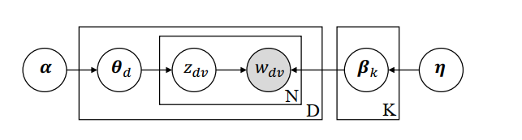
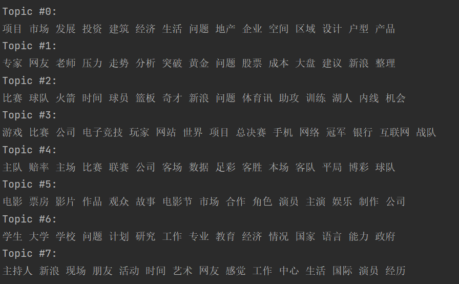
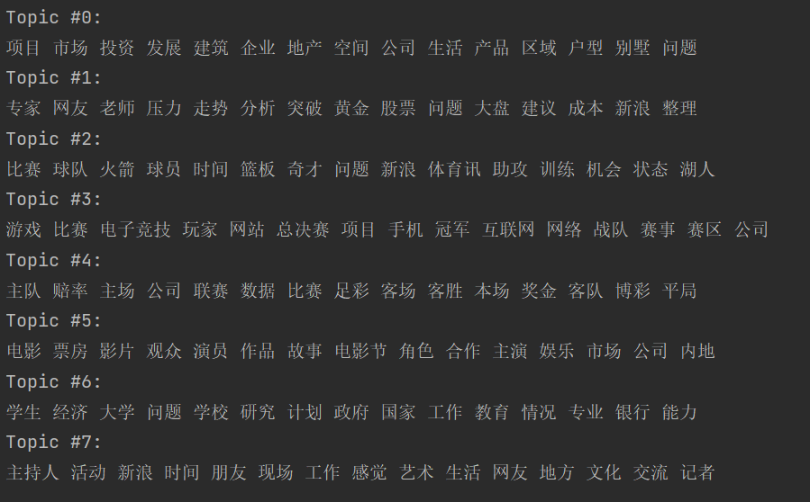

# MLlab4 report

**PB19000196 晏瑞然**

## 实验要求

给定的数据见文件夹，data.xlsx. 该数据集共两列，第一列表示文本的内容，第二列表示该文本的类别。共包含800篇中文文本。

实现LDA模型，并且输出训练好的LDA模型中每个主题下概率最高的15个单词.

检查的时候用腾讯会议远程检查，需要检查的话可以通过qq私信联系助教 （春节前）。

不得直接调用开源库中的LDA。

## 实验原理

###  LDA简介

潜在狄利克雷分配(LDA)，作为基于贝叶斯学习的话题模型，是潜在语义分析、概率潜在语义分析的扩展，于2002年由Blei等提出。LDA在文本数据挖掘、图像处理、生物信息处理等领域被广泛使用。

LDA模型是文本集合的生成概率模型。假设每个文本由话题的一个多项式分布表示，每个话题由单词的一个多项式分布表示，特别假设文本的话题分布的先验分布是狄利克雷分布，话题的单词分布的先验分布也是狄利克雷分布。先验分布的导入使LDA能够更好地应对话题模型学习的过拟合现象。

LDA的文本集合的生成过程如下：首先随机生成一个文本话题分布，之后再该文本的每个位置，依据该文本的话题分布随机生成一个话题，然后在该位置依据该话题的单词分布随机生成一个单词，直至文本的最后一个位置，生成整个文本。重复以上的过程生成所有文本。

LDA模型是含隐变量的概率图模型。模型中，每个话题的单词分布，每个文本的话题分布，文本的每个位置的话题是隐变量；文本的每个文职的单词是观测变量。LDA模型的学习与推理无法直接求解，通常使用吉布斯抽样和变分EM算法。前者是蒙特卡洛法，后者是近似计算。

### LDA基本单元

* **词（word）** ：待处理数据中的基本离散单元  
* **文档（document）** ：待处理的数据对象，由词组成，词在文档中不计顺序。数据对象只要能用“词袋”（bag-of-words）表示就可以使用话题模型  
* **话题（topic）** ：表示一个概念，具体表示为一系列相关的词，以及它们在该概念下出现的概率  

### LDA具体描述

假定数据集中共含 $K$ 个话题和 $M$ 篇文档，词来自含 $V$ 个词的字典：

+ $V$ 个词的字典 $\mathcal{V}=\{w_{1},w_{2},\dots,w_{V}\}$。

+ $M$ 篇文档 ${W}=\{{w}_{1},{w}_{2},\dots,{w}_{M}\}$。第 $m$ 篇文档由长度为 $N_{m}$ 的单词序列组成，其单词序列为 ${w}_{m}=(w_{m1},\dots,w_{mN_{m}})$ 。

+ 文档可以表示为话题的分布，即用长度为 $K$ 概率话题向量表示。第 $m$ 篇文档的概率话题向量为 ${\theta}_{m}\in[0,1]^{K}$, 其中 $\theta_{mk}=P(z_{k}|{w}_{m})$ 表示第 $m$ 篇文档中话题 $z_{k}$ 的概率。

+ $K$ 个话题 $\mathcal{Z}=\{z_{1},z_{2},\dots,z_{K}\}$。

  话题可以表示为词的分布，即用长度为 $V$ 的概率词向量表示。第 $k$ 个话题的概率词向量为 ${\beta}_{k}\in{[0,1]^{V}}$, 其中 $\beta_{kv}=P(w_{v}|z_{k})$ 表示第 $k$ 个话题中单词 $w_{v}$ 的概率。

+ 隐变量 ${Z}=\{{z}_{1},{z}_{2},\dots,{z}_{M}\}$, 与文档 ${W}$ 对应，其中 $z_{mn}$ 表示单词 $w_{mn}$ 的话题。 

LDA对应概率分布：
$$
p({W},{Z},{\beta},{\theta}\mid {\alpha},{\eta})=\prod_{m=1}^{M}p({\theta}_{m}\mid{\alpha})\prod_{k=1}^{K}p({\beta}_{k}\mid{\eta})\left(\prod_{n=1}^{N_{m}}p(w_{mn}\mid z_{mn},{\beta}_{k})p(z_{mn}\mid{\theta}_{m})\right)
$$
其中$p({\theta}_{m}\mid{\alpha}),p({\beta}_{k}\mid{\eta})$ 分别为以 ${\alpha}$ 和 ${\eta}$ 为参数的 $K$ 维和 $V$ 维狄利克雷分布。

### LDA模型生成过程：

生成文档 $d$ 的过程：

+ 从以 ${\alpha}$ 为参数的狄利克雷分布中随机采样一个话题分布 ${\theta}_{m}$;
+ 按如下步骤产生文档中的 $N_{m}$ 个词:
  + 根据 ${\theta}_{m}$ 进行话题指派，得到文档 $m$ 中的第 $n$ 个词的话题 $z_{mn}$;
  + 根据话题 $z_{mn}$ 所对应的词分布 ${\beta}_{k}$ 随机采样生成词 $w_{mn}$. 

生成主题 $k$ 的过程：

+ 从以 ${\eta}$ 为参数的狄利克雷分布中随机采样一个词分布 ${\beta}_{k}$.

生成方式图解如下：



### LDA参数估计

有如下两种求解方法：

* 通过吉布斯采样求解：通过使用随机化方法完成近似  
* 通过变分法求解： 使用确定性近似完成推断  

本实验使用吉普斯采样的方法进行求解。

### Gibbs采样

算法的基本思想：

* 对隐变量 ${\theta},{\beta}$积分，得到边缘概率$p({Z}\mid{W},{\alpha},{\eta})$
* 对后验概率进行吉布斯抽样，得到分布 $p({Z}\mid{W},{\alpha},{\eta})$ 的样本集合
* 利用这个样本集合对参数 ${\theta}$ 和 ${\beta}$ 进行参数估计

令$n_{m}^{k}$ 代表第m篇文档中分配给第k个主题的词的个数，对应的多项分布的计数为：$n_{m}=\left ( n_{m}^{1}, n_{m}^{2},..., n_{m}^{K} \right )$

令$n_{k}^{v}$ 代表第k个主题对应词典中第v个词的词个数，对应的多项分布的计数为：$n_{k}=\left ( n_{k}^{1}, n_{k}^{2},..., n_{k}^{V} \right )$

通过对隐变量 ${\theta},{\beta}$积分，得到：
$$
p(z, w \mid \alpha, \eta)=\prod_{m=1}^{M} \frac{\Gamma\left(\sum_{k=1}^{K} \alpha_{k}\right)}{\prod_{k=1}^{K} \Gamma\left(\alpha_{k}\right)} \cdot \frac{\prod_{k=1}^{K} \Gamma\left(n_{m}^{k}+\alpha_{k}\right)}{\Gamma\left(\sum_{k=1}^{K} n_{m}^{k}+\alpha_{k}\right)} \times \prod_{k=1}^{K} \frac{\Gamma\left(\sum_{v=1}^{V} \eta_{v}\right)}{\prod_{v=1}^{V} \Gamma\left(\eta_{v}\right)} \cdot \frac{\prod_{v=1}^{V} \Gamma\left(n_{k}^{v}+\eta_{v}\right)}{\Gamma\left(\sum_{v=1}^{V} n_{k}^{v}+\eta_{v}\right)}
$$
令$z_{mn}$ 表示第m篇文档的第n个词对应的主题，$z_{-mn}$ 代表z去掉$z_{mn}$ 后的主题分布。
$$
p\left(z_{m n} \mid z_{-m n}, w, \alpha, \eta\right)=\frac{p\left(z_{m n}, z_{-m n}, w \mid \alpha, \eta\right)}{p\left(z_{-m n}, w \mid \alpha, \eta\right)}
$$
可化简上式：
$$
\begin{aligned}
& p\left(z_{m n}=k \mid z_{-m n}, w, \alpha, \eta\right) \\
\propto & p\left(z_{m n}=k, z_{-m n}, w \mid \alpha, \eta\right) \\
=&\left(\frac{\Gamma\left(\sum_{i=1}^{K} \alpha_{i}\right)}{\prod_{i=1}^{K} \Gamma\left(\alpha_{i}\right)}\right)^{M} \prod_{j \neq m} \frac{\prod_{i=1}^{K} \Gamma\left(n_{j}^{i}+\alpha_{i}\right)}{\Gamma\left(\sum_{i=1}^{K} n_{j}^{i}+\alpha_{i}\right)}\left(\frac{\Gamma\left(\sum_{r=1}^{V} \eta_{r}\right)}{\prod_{r=1}^{V} \Gamma\left(\eta_{r}\right)}\right)^{K} \\
& \prod_{i=1}^{K} \prod_{r \neq v} \Gamma\left(n_{i}^{r}+\eta_{r}\right) \frac{\prod_{i=1}^{K} \Gamma\left(n_{m}^{i}+\alpha_{i}\right)}{\Gamma\left(\sum_{i=1}^{K} n_{m}^{i}+\alpha_{i}\right)} \prod_{i=1}^{K} \frac{\Gamma\left(n_{i}^{v}+\eta_{v}\right)}{\Gamma\left(\sum_{r=1}^{V} n_{i}^{r}+\eta_{r}\right)} \\
\propto & \prod_{i=1}^{K} \Gamma\left(n_{m}^{i}+\alpha_{i}\right) \frac{\Gamma\left(n_{i}^{v}+\eta_{v}\right)}{\Gamma\left(\sum_{r=1}^{V} n_{i}^{r}+\eta_{r}\right)} \\
\propto & \prod_{i \neq k} \Gamma\left(n_{m}^{i,-m n}+\alpha_{i}\right) \frac{\Gamma\left(n_{i,-m n}^{v}+\eta_{v}\right)}{\Gamma\left(\sum_{r=1}^{V} n_{i,-m n}^{r}+\eta_{r}\right)} \cdot \Gamma\left(n_{m}^{k,-m n}+\alpha_{k}+1\right) \frac{\Gamma\left(n_{k,-m n}^{v}+\eta_{v}+1\right)}{\Gamma\left(\sum_{r=1}^{V} n_{k,-m n}^{r}+\eta_{r}+1\right)} \\
=& \prod_{i} \Gamma\left(n_{m}^{i,-m n}+\alpha_{i}\right) \frac{\Gamma\left(n_{i,-m n}^{v}+\eta_{v}\right)}{\Gamma\left(\sum_{r=1}^{V} n_{i,-m n}^{r}+\eta_{r}\right)} \cdot\left(n_{m}^{k,-m n}+\alpha_{k}\right) \frac{\left(n_{k,-m n}^{v}+\eta_{v}\right)}{\left(\sum_{r=1}^{V} n_{k,-m n}^{r}+\eta_{r}\right)} \\
\propto &\left(n_{m}^{k,-m n}+\alpha_{k}\right) \frac{\left(n_{k,-m n}^{v}+\eta_{v}\right)}{\left(\sum_{r=1}^{V} n_{k,-m n}^{r}+\eta_{r}\right)}
\end{aligned}
$$
吉普斯采样具体算法：

（1）选择适当的主题总数K，及LDA模型参数$\alpha$、$\eta$；

（2）对应文集中的每一篇文档的每个词w，随机赋予一个主题编号z；

（3）重新扫描文集，对每个词w使用Gibbs采样公式更新它的主题编号，并更新文集中的词；

（4）重复采样过程直至收敛；

（5）统计文集中topic-word共现频率矩阵，即可得到LDA模型。

## 代码讲解

### LDA类

```python
class LDA(object):
    def __init__(self,
                 alpha=1 / 8,
                 eta=1 / 8,
                 k=8,  # number of topics
                 itr=50,
                 seed=None
                 ):
        self.alpha = alpha
        self.eta = eta
        self.K = k
        self.itr = itr
        self.seed = seed
        self.theta = None  # doc_topic_distr
        self.beta = None  # topic_word_distr
        self.ndz = None
        self.nzw = None
        self.nz = None
        self.Z = None  # (d,w),文章d的单词w对应话题
```

定义传入参数，alpha和eta的默认值为1/k，k为主题的数量。

类中属性主要是ndz,nzw,nz，分别表示文章d中话题z的个数，nzw表示话题z单词w的个数，nz表示文章d中z的总数，也可以将上面三个变量看作式子$\left(n_{m}^{k,-m n}+\alpha_{k}\right) \frac{\left(n_{k,-m n}^{v}+\eta_{v}\right)}{\left(\sum_{r=1}^{V} n_{k,-m n}^{r}+\eta_{r}\right)}$的三个乘子。属性z的含义如注释所示。

### LDA方法

```python
    def fit(self, X):
        if self.seed is not None:
            np.random.seed(self.seed)
        print("initializing...")
        self.init(X)
        print("init finished...")
        print("training begin:")
        for i in range(self.itr):
            self.gibbsSampling(X)
            print("Iteration: ", i + 1, " Completed", )`
```

主要是fit，fit的过程就是吉普斯采样的过程，进行itr次吉普斯采样，采样前需要进行基本的初始化，初始化ndz,nzw,nz等参数。注意传入参数是文章-单词的词频矩阵，而不是原始文章，这与sklearn中的LDA方法相同。

```python
    def init(self, X):  # random init matrix
        self.Z = []
        N, M = X.shape
        self.ndz = np.zeros([N, self.K]) + self.alpha
        self.nzw = np.zeros([self.K, M]) + self.eta
        self.nz = np.zeros([self.K]) + M * self.eta
        for d, fword in enumerate(X):  # fword:每篇文章的词频
            doc_zlist = []
            for w, f in enumerate(fword):
                if f != 0:
                    for _ in range(f):
                        pz = np.divide(np.multiply(self.ndz[d, :], self.nzw[:, w]), self.nz)
                        z = np.random.multinomial(1, pz / pz.sum()).argmax()  # 随机选择
                        doc_zlist.append(z)
                        self.ndz[d, z] += 1
                        self.nzw[z, w] += 1
                        self.nz[z] += 1
            self.Z.append(doc_zlist)
```

init主要是初始化参数，先初始化ndz,nzw,nz，然后遍历每篇文章的每个单词初始化z加入Z矩阵，初始化的方法是直接随机选择文章中单词对的话题，即等概率挑选z。由于X是词频矩阵，所以遍历文章单词的方法是直接找每个不是0的单元在进行词语个数大小的遍历取z，能这样做的原因是LDA并不在意词语出现的顺序，只需要词袋结构就能表示整个文章。

```python
   def gibbsSampling(self, X):
        if self.Z is None:
            print("you need to init first!")
        # 为每个文档中的每个单词重新采样topic
        for d, fword in enumerate(X):
            index = 0
            for w, f in enumerate(fword):
                if f != 0:
                    for _ in range(f):
                        z = self.Z[d][index]
                        # 除去自身
                        self.ndz[d, z] -= 1
                        self.nzw[z, w] -= 1
                        self.nz[z] -= 1
                        # 重新计算当前文档当前单词属于每个topic的概率
                        pz = np.divide(np.multiply(self.ndz[d, :], self.nzw[:, w]), self.nz)
                        # 按照计算出的分布进行采样
                        z = np.random.multinomial(1, pz / pz.sum()).argmax()
                        self.Z[d][index] = z
                        # 还原
                        self.ndz[d, z] += 1
                        self.nzw[z, w] += 1
                        self.nz[z] += 1
                        index += 1
```

吉普斯采样的过程与Init的过程类似，也是直接遍历每个单词通过公式$\left(n_{m}^{k,-m n}+\alpha_{k}\right) \frac{\left(n_{k,-m n}^{v}+\eta_{v}\right)}{\left(\sum_{r=1}^{V} n_{k,-m n}^{r}+\eta_{r}\right)}$计算出z的概率分布pz，然后对其进行multinomial采样，然后修改Z矩阵，注意公式计算中要减去自身，最后要还原。

### 主函数

```python
if __name__ == '__main__':
    data_path = "./data/data.xlsx"
    dic_file = "./data/dict.txt"
    stop_file = "./data/stopwords.txt"
    data = pd.read_excel("./data/data.xlsx")  # content type
    data["content_cutted"] = data.content.apply(chinese_word_cut)
    n_features = 1000  # 提取1000个特征词语
    tf_vectorizer = CountVectorizer(strip_accents='unicode',
                                    max_features=n_features,
                                    stop_words='english',
                                    max_df=0.5,
                                    min_df=10)
    tf = tf_vectorizer.fit_transform(data.content_cutted)
    doc_word_mat = tf.toarray()
    n_topics = 8
    mylda = LDA(seed=0, itr=10)
    mylda.fit(doc_word_mat)
    n_top_words = 15
    tf_feature_names = tf_vectorizer.get_feature_names()
    for topic_idx, topic in enumerate(mylda.nzw):
        print("Topic #%d:" % topic_idx)
        topic_w = " ".join([tf_feature_names[i] for i in topic.argsort()[:-n_top_words - 1:-1]])
        print(topic_w)
```

本实验最复杂的本应该是将文本划词的过程，但由于助教给了代码，就不用自己写划词的代码了，直接用所给代码的方法进行划词，源码中沿用1000个特征词的参数，用sklearn中的CountVectorizer进行划词，并查看相关接口可以使用`.toarray()`方法直接得到词频矩阵。

得到每个话题的前15单词方法是直接找到属性nzw，之前说了这个属性对应话题z对应单词的频率，可以直接将其看作话题单词的分布，找到其中概率最高的15个单词即为最终结果。

## 实验遇到的问题及解决方案

### 问题1：参数传入问题

之前一直以为传入参数是将每篇文章单词向量化后的矩阵，接口也是这样定义的，但后来发现通过CountVectorizer进行划词后得到的是词频矩阵，而且又因为CountVectorizer好像是一种学习方法，将文章转成了特征词语的向量，所以无法将频率矩阵转为原始数据矩阵。导致几乎全部代码都得重写，甚至想自己实现分词功能，当然效果也是非常差。

**解决方法：**

后来发现sklearn中的LDA接口也给的是词频矩阵，最后还是沿用了词频矩阵的参数输入，修改了LDA中词语遍历策略，也就是代码讲解中的策略。

### 问题2：实验原理复杂

由于实验原理过于复杂，我大部分时间都花在了看懂LDA吉普斯采样算法上，但实际上算法真正实现起来并不困难。

**解决方法：**

多看几遍....

## 实验结果展示

为了可复现性，随机种子设定为0

以下是训练10轮的结果：(耗时约10s)



可以看出topic0都是地产相关，topic1都是股票相关，topic2都是体育比赛相关......当然因为训练次数的限制有些话题其实并不清晰，比如topic7，可能可以归类为娱乐与新闻报道类，但总体来讲还是比较混乱。但大体上每个topic对应的单词还是比较吻合的。

以下是训练50轮的结果：(耗时约1min)



可以看出结果与训练10轮基本相似，说明算法基本已经收敛，感觉topic7还是新闻报道类词语，可能是因为这类词语本就比较模糊与广泛，不好看出到底属于哪一类，而原始数据本来就是截取的报道，这类词语又比较多，所以会有这种情况的发生。

## 实验总结

本次实验相较于之前的实验，难点并不在实现代码的复杂，也不在于训练速度，主要在于原理部分，刚开始拿到了这个实验可能会束手无策，根本动不了手。通过本次试验，也算是对LDA有了一个深入的了解，在模型理论与算法的具体实现的方面有了清晰的认识，也算是我收获最大的一个实验了(也是最难的)。
